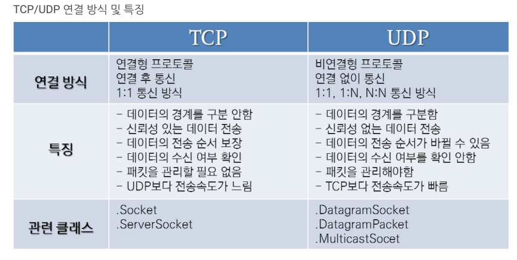
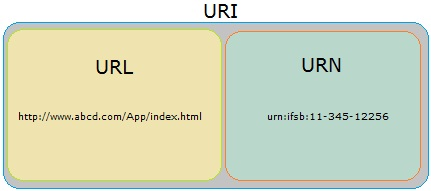
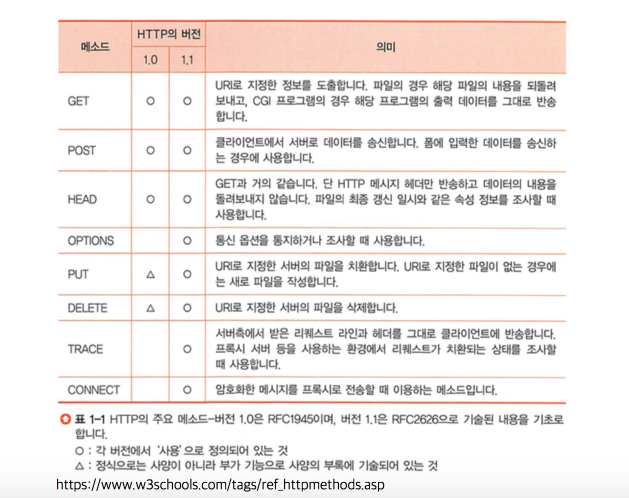

# 네트워크(Network) 기본 지식

## 네트워크란? 
  - `정보나 노동력 등 자산을 서로 주고받을 수 있는 상태` = `망`, `망상 조직`

## 컴퓨터 네트워크 
  - `컴퓨터끼리 케이블(동축 케이블이나 광섬유 케이블 등)이나 적외선, 전파(무선) 등 어떤 수단을 사용하여 연결해 다양한 데이터를 주고받을 수 있는 상태`
  - 컴퓨터 네트워크는 규모에 따라 LAN, WAN, 인터넷, intranet 으로 구성

## 프로토콜(Protocol)이란? 
  - 기기(컴퓨터)끼리 문제없이 교류할 수 있도록 정해진 절차
  - TCP/IP라는 공통된 구조로 전 세계 네트워크를 연결한 것이 인터넷.
  - 규약/약속의 의미를 지님(외교 문서를 protocol 이라고 함)
  - 서로 다른 시스템에 있는 두 개체간에 성공적으로 데이터를 전송하는 통신 규약

## 계층화
  - TCP/IP는 송수신에 필요한 작업을 몇 개의 단계로 나눠서 수행 단계를 층(Layer)라고 한다. 
  - 계층화의 장점 : 계층마다 작업을 독립시킨다.

## OSI 7 Layer
  - 위로 갈수록 사용자와 가까운 작업을, 아래로 갈수록 기계와 가까운 작업을 담당한다.

  - L5~L7 : (세션, 표현, 응용 계층)
    - `세션 계층`
      - 네트워크 대화 제어자 
      - 프로세스 간의 통신을 제어하고, 통신 과정이 진행 될 때 동기화를 유지(각종 이벤트)
    - `표현 계층`
      - 통신 장치간의 상호 운용성(interoperability) 보장
      - 필요에 따라 보안 목적을 위한 데이터 암호화와 복호화 기능
      - 데이터 압축 및 확장 기능 (예: ASCII, EBCDIC, JPEG)
    - `애플리케이션층`
      - 애플리케이션에 맞춰 통신을 수행할 수 있도록 한다. 애플리케이션마다 다양한 프로토콜이 존재
      - HTTP / SMTP / POP3 / FTP / TELNET / NNTP / RCP / ...

  - L4 : `트랜스포트층` 전송 계층 
    - 송신된 데이터를 수신측 애플리케이션에 확실히 전달하기 위해 작동 (번호, 데이터를 조합하기 위한 정보)
    - TCP / UDP
    - `TCP / UDP 차이`

    - `UDP 프로토콜`
      - 운영체제에는 세그먼트의 포트를 보고 어느 어플리케이션에 데이터를 넘겨 줄것인지 결정함
      - 상태를 갖지 않음
      - 패킷 유실 가능성 존재
      - DNS, DHCP, 스트리밍등에 사용 (VoIP, mVoIP 등)
      - 프로토타이핑에 적합 (단순)
    - `TCP 프로토콜`
      - 운영체제에는 세그먼트의 포트를 보고 어느 어플리케이션에 데이터를 넘겨 줄것인지 결정함
      - 상태를 가진 프로토콜
      - 신뢰성 보장 프로토콜
      - 대부분의 상위 프로토콜에서 사용(HTTP, EMAIL, NEWS 등)
      - 복잡함
    - `NAT (Network Address Translation)`
      - TCP/UDP 패킷의 포트와 IP 패킷의 IP를 일시적으로 변형
      - NAT를 쓰는 이유 : 여러 대의 호스트가 하나의 공인 IP 주소를 사용하여 인터넷 이용
      - REQUEST/RESPONSE를 변형하는 과정은 computing power를 소모한다.
    - `공유기`
      - 더미 허브 vs 스위치 허브
      - L2 / L3 / L4 스위치

      ​
  - L3 : `네트워크층(IP)`
    - 수신측 컴퓨터까지 데이터를 전달하기 위해 작동, 전달된 데이터가 손상됐는지나 수신측이 잘 받았는지는 관여하지않음
    - `IP(Internet Protocol)`
      - 송신 호스트와 수신 호스트가 패킷 교환 네트워크(패킷 스위칭 네트워크)에서 정보를 주고 받는데 사용하는 정보 규약
      - 호스트의 주소지정과 패킷 분할 및 조립 기능을 담당한다
    - `IP 주소`
      - 32비트형 0.0.0.0 ~ 255.255.255.255
      - 공인 IP / 사설 IP
      - 클래스 A, B, C
    - 패킷(packet)
      - 데이터 전송시는 데이터를 일정한 크기로 잘라서 보내는데, 패킷이란 이때 사용되는 정보의 전송 단위로, 한 패킷은 보통 1,024비트
      - TCP/IP의 특중 중 하나
      - `데이터를 일정한 크기로 분할해서 보낸다`, 작게 나눠진 데이터 하나를 패킷이라고 하며, 이런 통신방법을 `패킷통신`이라함
    - `DNS(Domain Name System)`
      - 이름과 IP 주소를 매핑해주는 거대한 분산 시스템
      - DNS RESOLVER -> RESOLVER
      - RESOLUTION - 해상도(解像度)
      - wireshark를 가지고 DNS 패킷을 살펴보자.
        - NS(Name Server) 레코드
          - 해당 도메인에 대한 네임서버를 명시 할 때 사용
          - IN NS ns.abc.com
          - IN NS ns2.abc.com
        - A(Address) 레코드
          - 도메인에 IP 부여
          - www  IN  A  192.168.0.1 
          - ns  IN A 192.168.0.1
        - CNAME(Canonical Name) 레코드
          - 도메인에 대한 또 다른 이름이 사용 가능하도록 사용
          - A레코드에 표시
          - ftp IN CNAME www
        - MX(Mail eXchanger) 레코드
          - 메일 라우팅 경로 조절
          - @ IN MX 10 mail 
          - @ IN MX 20 submail 
        - PTR(Pointer) 레코드 
          - IP 주소에 대한 도메인명을 매핑 (A 레코드의 역)
          - 1 IN PTR www.abc.com
    - `라우터(router)`
      - 패킷이 지나갈 길을 인도해주는 기계
      - 고속도로의 IC를 생각하면 됨
      - 라우팅 테이블

      ​

  - L2 : `데이터 링크층`
    - 네트워크에 직접 연결된 기기간을 전송할 수 있도록 만든다, 네트워크층과 물리층간의 차이를 흡수하기 위한 다양한 프로토콜 존재
    - Ethernet / FDDI / PPP
    - `Ethernet`
      - 컴퓨터 네트워크 기술
      - LAN에서 가장 많이 활용되는 기술 규격
      - Ethernet 물리구조
      - Ethernet Frame
    - `ARP (Address Resolution Protocol)`
      - IP 주소와 렌카드의 맥주소를 매칭
      - ARP 패킷 구조
      - ARP 프로토콜 살펴보기

      ​

  - L1 : `물리층` 
    - 데이터를 신호로, 신호를 데이터로 변환한다. 
    - 변환 방법은 통신 매체에 의존하기 때문에 특정 프로토콜이 정해져 있지 않음
    - `변조(modulation) / 복조(demodulation)`
      - 변조 : 정보를 전송 매체의 채널 특성에 맞게 변환 
      - 복조 : 변조된 신호를 역으로 정보로 변환
      - 모뎀(MODEM) : MOdelation DEmodulation Machine
    - `아날로그 변조 방식`
      - 진폭 변조 (AM - Amplitude Modulation)
      - 주파수 변조 (FM - Frequency Modulation)
      - 위상 변조 (PM - Phase Modulation)
    - `ADSL(Asymmetric Digital Subscriber Line)`
      - DMT(Discrete MultiTone) 변조 사용 - 여러개의 QAM 사용
      - 뜻 : 비대칭 디지털 가입자 회선 (다운로드 8Mbps, 업로드 640Kbps)
      - 전화선(구리선)을 ‘그대로’ 이용하면서 고속 데이터 통신 가능


- [참고문헌]
  - ANK Co. Ltd.,『TCP/IP가 보이는 그림책』, 성안당(2015)

- [참조링크]
  - [네트워크기초](http://iam-jun.tistory.com/2)


## URL(Uniform Resource Locator)
  - 리소스(resource)의 위치를 나타내는 것
  - 웹사이트를 가리키는 주소를 나타내는 것이 일반적이지만 웹사이트 주소뿐만이 아니라 메일주소나 FTP주소 등도 여기에 포함된다.
  - URN(Uniform Resource Name)
    - URL의 경우 위치를 기반으로 두고 있기 때문에 해당 위치에 있는 자원이 없어질 경우 검색수단으로써 기능을 상실한다. 이를 보안하고자 만들어 진것이 URN.  
  ```(urn : isbn : 9788982814471)```
  - URI(Uniform Resource Identifier)
    - 모든 정보의 리소스를 가리키는 식별자  


-----

##  HTTP

###  HTTP REQUEST MESSAGE
  - 요청라인 : 서버에 요청할 주 내용
  - 요청 헤더 : 요청에 대한 부가 정보들을 보낸다.  
    1.User-Agent : 클라이언트의 접속환경 정보  
    2.Accept :얻기원하는 미디어 타입정보  
    3.Cookie : 인증정보  
    4.Referer : 참조페이지  
    5.Host : 서버호스트  
 - 공백 라인 : 메세지 본문과 요청부분을 구분
 - 메세지 본문 : 메세지 내용


###  HTTP REQUEST METHOD



###  HTTP 메서드 - GET

- 의도 : GET 하는것 (데이터를 가져오는것)
- 파라메터를 주소에 넣음 -> 웹브라우저에서 보임
- 많은양의 파라메터 보내기에 부적합
- 북마크 / 공유 가능
- 브라우저의 history에 등록 가능


### HTTP 메서드 - POST

- 의도 : POST 하는것
- 파라메터를 body에 넣음 -> 눈으로는 볼수 없음
- 다량의 데이터를 보낼 수 있음
- 북마크 / 공유 불가 
- 브라우저의 history로 재현 불가


### HTTP 서버 응답 코드 (Response Code) 정리
- HTTP 통신 시, 서버에서 보내주는 응답 코드에 대해 간단히 정리
- 클라이언트(웹 브라우저)에서 서버에 어떠한 요청(리퀘스트, Request)를 하면 서버는 응답(리스폰스, Response) 한다.
- 적절한 처리가 이루어져서 성공 응답과 함께 결과 값을 보내주기도 하고, 정상적인 처리가 되지 않은 경우에는 실패 응답과 함께 에러 정보를 보내주기도 한다.
- 서버가 정상 응답한 경우, 200 코드를 보내준다. 200을 포함하여 200번대 응답은 서버에서 정상적으로 처리하여 응답한 경우, 보내주는 값이다.
- 각 코드는 100번대 단위로 응답 코드가 구분되어 있다. 즉, 300번대끼리, 400번대끼리 유사한 형태의 응답 코드라는 의미한다.
- 3자리 숫자의 첫번째 값(코드)만 보고도 어떤 종류의 응답인지 알 수 있다. 이 첫번째 값을 Response Class라고 한다.


### Response Code 

| Response Class Code | Response Class 의미       | 설명                       |
| ------------------- | ----------------------- | ------------------------ |
| 1                   | Informational (정보)      | 리퀘스트를 받고, 처리 중에 있음.      |
| 2                   | Success (성공)            | 리퀘스트를 정상적으로 처리함.         |
| 3                   | Redirection (리디렉션)      | 리퀘스트 완료를 위해 추가 동작이 필요함.  |
| 4                   | Client Error (클라이언트 오류) | 클라이언트 요청을 처리할 수 없어 오류 발생 |
| 5                   | Server Error (서버 오류)    | 서버에서 처리를 하지 못하여 오류 발생    |


### 자주 접하는 코드를 위주로 작성

**200 번대 응답(Response) : 성공(Success)**

| 번호   | 이유              | 설명                                       |
| ---- | --------------- | ---------------------------------------- |
| 200  | OK              | 요청 정상 처리.                                |
| 204  | No Content      | 요청 정상 처리하였지만, 돌려줄 리소스 없음.                |
|      |                 | 응답에 어떠한 엔티티 바디(Entity Body)도 포함하지 않음.    |
|      |                 | 서버에서 처리 후, 클라이언트에 정보를 보낼 필요가 없는 경우 사용.   |
| 206  | Partial Content | Range가 지정된 요청인 경우, 지정된 범위만큼의 요청을 받았다는 것을 알려줌. |

<br>

**300 번대 응답(Response) : 리디렉션(Redirection)**

| 번호   | 이유                 | 설명                                       |
| ---- | ------------------ | ---------------------------------------- |
| 301  | Moved Permanently  | 요청된 리소스에는 새로운 URI가 지정되어 있기 때문에, 이후로는 새 URI를 사용해야 한다는 것을 나타냄. (영구적인 URI 변경) |
| 302  | Found              | 요청된 리소스에는 새로운 URI가 지정되어 있기 때문에, 이후로는 새 URI를 사용해야 한 다는 것을 나타냄. 301과 유사하지만, 302는 일시적인 URI 이동) |
| 303  | See Other          | 이 응답은 요청에 대한 리소스는 다른 URI에 있기 때문에 GET 메서드를 사용해서 얻어야 한다는 것을 나타냄. 302 코드와 같지만, 303은 리디렉션 위치를 GET 메서드를 통해 얻어야 한다고 명확하게 되어 있음. |
| 304  | Not Modified       | 요청한 리소스가 마지막 요청 이후 변경된 적이 없기 때문에 기존 클라이언트의 로컬 캐시 리소스를 사용하도록 알려줌.300번대로 분류되어 있지만, 리디렉션과는 관계없는 처리를 함. |
| 307  | Temporary Redirect | 임시로 페이지를 리다이렉트 함.                        |

<br>

**400 번대 응답(Response) : 클라이언트 에러 (Client Error)**

| 번호   | 이유                 | 설명                                       |
| ---- | ------------------ | ---------------------------------------- |
| 400  | Bad Request        | 클라이언트의 요청 구문이 잘못됨.                       |
|      |                    | 브라우저는 이 응답을 200 OK 응답과 동일한 형태로 취급함.      |
| 401  | Unauthorized       | 요청 처리를 위해 HTTP 인증(BASIC 인증, DIGEST 인증) 정보가 필요함을 알려줌. |
|      |                    | 접근 허용을 차단함. 최초 요청에는 인증 다이얼로그 표시하고, 두번째는 인증 실패 응답을 보냄. |
| 403  | Forbidden          | 접근 금지 응답. Directory Listing 요청(서버 파일 디렉토리 목록 표시) 및 관리자 페이지 접근 등을 차단하는 경우의 응답. (파일 시스템 퍼미션 거부, 허가 되지 않은 IP 주소를 통한 액세스의 거부 등) |
|      |                    | 서버는 엔티티 바디에 접근 거부에 대한 이유를 명시하여 보낼 수 있음.  |
| 404  | Not Found          | 클라이언트가 요청한 리소스가 서버에 없음                   |
| 405  | Mothod Not Allowed | 허용되지 않는 HTTP 메서드를 사용함.                   |

<br>

**500 번대 응답(Response) : 서버 에러 (Server Error)**

| 번호   | 이유                         | 설명                                      |
| ---- | -------------------------- | --------------------------------------- |
| 500  | Internal Server Error      | 서버에서 클라이언트 요청을 처리 중에 에러가 발생함.           |
| 503  | Service Unavailable        | 서버가 일시적으로 요청을 처리할 수 없음.                 |
|      |                            | 서버가 과부하 상태이거나 점검중이므로 요청을 처리할 수 없음을 알려줌. |
| 504  | Gateway Timeout            | 서버를 통하는 게이트웨이에 문제가 발생하여 시간이 초과됨.        |
| 505  | HTTP Version Not Supported | 해당 HTTP 버전에서는 지원되지 않는 요청임을 알려줌.         |


### 쿠키(cookie)
- 헤더에 담김
- HTTP의 약속에 의해 생성/소멸
- Response Header의 Set-Cookie 속성 사용하여 쿠키 생성
- 만들어진 쿠키는 사용자가 요청하지 않아도 브라우저가 매번 Request Header에 넣어서 서버에 전송


### 세션(Session)의 정의
- 일정 시간동안 같은 사용자(정확하게 브라우저)로 부터 들어오는 일련의 요구를 하나의 상태로 보고 그 상태를 일정하게 유지.
- 세션은 서버 메모리에 저장되지만  세션 역시 클라이언트에 쿠키로 저장된다.


- [참조서적]
  - 그림으로 배우는 Http & Network Basic
- [참조링크]
  - [이러쿵저러쿵](http://ooz.co.kr/260)
  - [wikipedia](https://en.wikipedia.org/wiki/List_of_HTTP_status_codes)
  - [wikipedia : HTTP 상태 코드](https://ko.wikipedia.org/wiki/HTTP_%EC%83%81%ED%83%9C_%EC%BD%94%EB%93%9C)
  - [w3schools : http messages](https://www.w3schools.com/tags/ref_httpmessages.asp)

  - HTTP 상태 코드 (HTTP Status Codes) 에 대한 정의를 포함하고 있는 문서.
    - [RFC2616 참조 문서](http://tools.ietf.org/html/rfc2616)
    - [RFC4918 참조 문서](http://tools.ietf.org/html/rfc2616)
    - [RFC5842 참조 문서](https://tools.ietf.org/html/rfc5842)
    - [RFC6585 참조 문서](http://tools.ietf.org/html/rfc6585)

-----

## REST API(Representational State Transfer API)
  - REST는 최근 서버에 접근하는 기기의 종류가 다양해 지면서 다양한 기기에서 공통으로 데이터를 처리할 수 있는 규칙을 만들려고 하는데 이러한 시도가 REST 방식.
  - REST API는 외부에서 REST방식으로 특정 URI를 통해서 사용자가 원하는 정보를 제공하는 방식.


## POSTMAN 사용
  - POSTMAN은 GET, POST, PUT, DELETE 등의 client 사이드 요청을 보내고 응답받아 api를 테스트할 수 있는 도구

